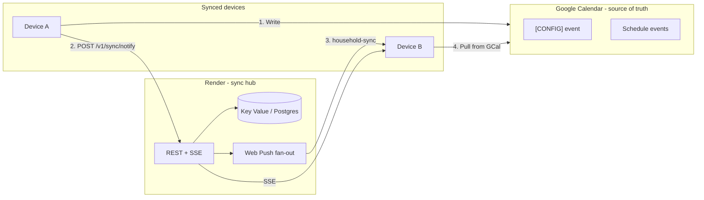
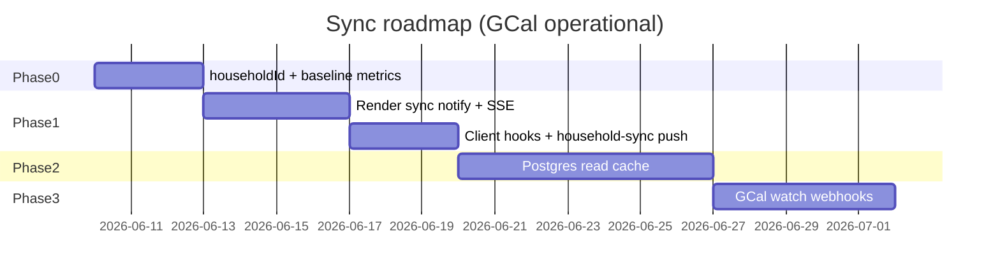

# Near-Real-Time Sync Roadmap

PolySchedule already shares household data through **Google Calendar** when devices use **Google Calendar API Sync Mode**. Config (partners, homes, rules, pronouns) lives in a `[CONFIG] PolySchedule Core Settings` calendar event; proposals and approved schedule items are calendar events with JSON metadata in the description.

**What works today (GCal sync operational):**

- Writes from any synced device persist to the shared calendar.
- Other devices see changes after a **full app reload** (bootstrap pulls config + events from GCal).
- Proposal workflow can already trigger **Web Push** via Render for review alerts.

**What does not work today:**

- No **live** or **near-live** propagation — no polling, SSE, or “data changed” push.
- Profile/config edits (e.g. pronouns) do not notify other devices.
- Each browser still stores OAuth tokens, API keys, and session locally (not synced).
- Sync mode does not mirror config into `polyschedule_local_config` on every GCal save (memory + GCal are authoritative until next load).

This roadmap adds a **Render Sync Hub** on top of working GCal so devices learn about changes in seconds instead of only on reload.

---

## Goals

| Target | Latency | Scope |
|--------|---------|--------|
| Near-real-time (foreground) | 2–10 s | Config, proposals, votes, schedule |
| Near-real-time (background) | 10–30 s | Same, via silent/data push + service worker pull |
| Offline | Immediate local, reconcile on reconnect | Unchanged |

**Source of truth:** Google Calendar remains the durable household store. Render coordinates **when** other devices should pull from GCal (Phase 1–3). Render may cache reads for speed (Phase 2), not replace GCal unless Phase 5 is pursued later.

---

## Architecture

---

## Phase 0 — Baseline with working GCal (2–3 days)

GCal sync is operational; this phase establishes identity and metrics before building the hub.

### 0.1 Household identity

Introduce stable IDs in the GCal config JSON (written with the next config save):

| Field | Purpose |
|-------|---------|
| `householdId` | UUID; registers the household with Render |
| `syncRevision` | Monotonic integer; incremented on every config or event write |

Admin UI: **Generate household sync key** (creates `householdId`, shows copyable token for Render registration).

### 0.2 Multi-device verification checklist

- [ ] Two phones, same `calendarId`, both in sync mode with credentials + **Sync Google**
- [ ] Device A edits partner pronouns → config event updates in Google Calendar
- [ ] Device B **reload** → sees new pronouns (confirms GCal path end-to-end)
- [ ] Device A submits proposal → Device B reload → proposal visible
- [ ] Measure baseline: time from B reload to UI updated (establish “reload latency” for comparison)

### 0.3 Document per-device setup

Each install still needs locally: OAuth client ID, API key, calendar ID, and per-user Google sign-in. The sync hub does not remove this; it only removes the need to **reload** after someone else changes data.

---

## Phase 1 — Notify-to-pull (3–5 days) ★ Start here

**Idea:** After a successful GCal write, the authoring device tells Render; other household devices pull fresh data from GCal.

### Render API (extend `notify-service`)

| Endpoint | Purpose |
|----------|---------|
| `POST /v1/sync/register` | Register device: `householdId`, `partnerId`, `deviceId`, optional push `subscription` |
| `POST /v1/sync/notify` | `{ householdId, revision, scopes: ['config','events'], actorPartnerId, excludeDeviceId? }` |
| `GET /v1/sync/stream?householdId=…` | **SSE**: `config-changed`, `events-changed`, `revision` |
| `GET /v1/sync/status?householdId=…` | `{ revision, updatedAt }` for lightweight polling fallback |

**Storage:** Render **Key Value** (Redis-compatible):

- `household:{id}:revision` — integer
- `household:{id}:devices` — registered device list (or keep push subscriptions in existing store keyed by household)

Auth: household-scoped token (generated in Admin alongside `householdId`); reuse `X-Notify-Secret` for server-to-server admin operations.

### Client hooks (after GCal success)

| Action | Notify scope |
|--------|----------------|
| `saveConfig()` | `config` |
| Proposal submit / vote / approve / decline / retract / archive | `events` |
| Add/edit/delete partner or home | `config` (+ `events` if references renamed) |

Increment `syncRevision` in config before notify.

### Client listeners

1. **Foreground:** SSE connection while logged in → on event, call `CalendarSync.loadConfig()` / `loadEvents()` → update `state` → `renderView()` (no full page reload).
2. **Background:** New push type `household-sync` with `{ revision, scopes }` → service worker → `postMessage` to clients → same pull path.
3. **Fallback:** If SSE disconnects, poll `GET /v1/sync/status` every 30–60 s while app is foreground (optional, Phase 1b).

### New push type

| type | When |
|------|------|
| `household-sync` | Config or schedule changed on another device (respect quiet hours: optional silent pull only) |
| Existing `proposal-*` types | Keep for actionable notifications; can also trigger pull |

**Expected latency:** 2–10 s foreground, 10–30 s background.

**GCal role:** Sole data store; Render never holds household JSON in Phase 1.

---

## Phase 2 — Render read cache (5–8 days)

GCal works but is slower and quota-sensitive. Add a **fast read path** on Render while keeping GCal as write-through archive.

### Storage (Render Postgres recommended)

| Table | Contents |
|-------|----------|
| `households` | `id`, `calendar_id`, `revision`, `config_json`, `updated_at` |
| `event_snapshots` | `household_id`, `event_id`, `revision`, `payload_json` (or blob per household) |
| `devices` | registration + last_seen |

### Write path

1. Client writes to GCal (as today).
2. On success → `POST /v1/sync/push` with config and/or changed event IDs + `revision`.
3. Render upserts cache, broadcasts SSE / `household-sync` push.

### Read path

1. On notify → `GET /v1/sync/config?sinceRevision=N` and `GET /v1/sync/events?sinceRevision=N`.
2. Merge into app state.
3. If Render `revision` < local `syncRevision` or fetch fails → pull from GCal (existing code).

**Expected latency:** 1–5 s for profile/pronoun/config changes.

**Example (admin changes Katie’s pronouns on phone A):** GCal config event updated → Render cache updated → Katie’s phone B receives SSE/push → pulls from Render (or GCal fallback) → UI updates without reload.

---

## Phase 3 — Google Calendar watch webhooks (4–6 days)

With GCal reliable, watches catch changes **outside** the app (Google Calendar app, calendar.google.com, another client).

1. Render registers GCal **watch** on the household calendar (renew via cron ~weekly).
2. Google POSTs to `https://<notify-service>/v1/gcal/webhook`.
3. Render bumps `revision`, broadcasts to household (does not parse full payload on webhook — clients pull).
4. Handles edge case: Device A writes to GCal but crashes before `POST /v1/sync/notify`.

---

## Phase 4 — Conflict handling (parallel with Phase 2+)

| Mechanism | Behavior |
|-----------|----------|
| `syncRevision` check | Save rejected if client revision stale → “Updated elsewhere — refresh?” |
| Per-event `revision` | Already on proposals; extend for optimistic concurrency |
| Last-write-wins | Default for v1 if no conflict UI |

---

## Phase 5 — Optional: Postgres as source of truth (later)

Only if GCal operational cost or latency remains unacceptable:

- Writes go to Postgres first; GCal mirror async.
- Enables encrypted credentials, proper auth, sub-second WebSockets.
- Large effort; **not required** now that GCal sync works.

---

## Security notes

| Topic | Approach |
|-------|----------|
| Household token | Per-household secret in Admin; required for register/notify |
| Passwords in GCal config | Still plaintext in config event today; migrate to server auth in Phase 5 |
| Push + SSE | Same origins / `ALLOWED_ORIGINS` as notify service |
| Google tokens | Remain per-device; sync hub does not store OAuth tokens |

---

## Implementation order

---

## Success metrics

| Metric | Target (Phase 1) |
|--------|------------------|
| Config change visible on other device | &lt; 15 s (foreground) |
| Proposal vote visible on other device | &lt; 15 s |
| GCal consistency | 100% — Render notify only after GCal write succeeds |
| Reload required | No (for household data) |

---

## Related docs

- [GOOGLE_CALENDAR.md](./GOOGLE_CALENDAR.md) — GCal data model and setup
- [SECURITY.md](./SECURITY.md) — localStorage and credential notes
- `notify-service/README.md` — Render deploy and push types
